# 3. Planificación

## 3.1. Iniciación del proyecto

### 3.1.1. Contexto de inicio

El proyecto "Plataforma de Gestión de TFG" se inicia como respuesta a la necesidad identificada en el entorno académico universitario de modernizar y automatizar los procesos de gestión de Trabajos de Fin de Grado. La iniciación formal del proyecto tuvo lugar tras un análisis preliminar de los procesos existentes y la identificación de oportunidades de mejora significativas en la eficiencia y trazabilidad del proceso académico.

La decisión de desarrollo se basó en tres factores críticos: la disponibilidad de tecnologías web modernas que permiten desarrollo rápido y escalable, la experiencia previa en desarrollo full-stack con React y PHP, y la posibilidad de crear una solución integral que abarque todos los roles involucrados en el proceso de TFG.

### 3.1.2. Análisis de viabilidad

**Viabilidad técnica**: El proyecto presenta alta viabilidad técnica dado que utiliza tecnologías consolidadas y ampliamente documentadas. React 19 y Symfony 6.4 LTS proporcionan ecosistemas maduros con extensas comunidades de soporte. La arquitectura propuesta (frontend SPA + backend API) es un patrón arquitectónico probado y escalable.

**Viabilidad temporal**: Con una planificación de 10 semanas distribuidas en 8 fases iterativas, el cronograma permite desarrollo incremental con entregas funcionales progresivas. La experiencia previa en las tecnologías seleccionadas reduce significativamente los riesgos de desviación temporal.

**Viabilidad de recursos**: El proyecto requiere únicamente recursos de desarrollo software y herramientas open-source o de libre acceso educativo. El entorno DDEV containerizado garantiza consistencia independientemente del hardware de desarrollo disponible.

### 3.1.3. Definición del alcance inicial

El alcance inicial se estableció mediante la definición de requisitos mínimos viables (MVP) para cada rol de usuario:

- **Estudiante**: Subida de TFG, seguimiento de estado, visualización de feedback
- **Profesor**: Gestión de TFG asignados, sistema de comentarios, cambios de estado
- **Presidente de Tribunal**: Creación de tribunales, programación de defensas
- **Administrador**: Gestión de usuarios, reportes básicos, configuración del sistema

Esta definición de MVP permite validación temprana de hipótesis y ajuste incremental de funcionalidades según feedback obtenido.

## 3.2. Iteraciones del proceso de desarrollo

El desarrollo se estructura en iteraciones que siguen un patrón consistente: análisis de requisitos específicos, diseño de componentes, implementación, testing básico y validación funcional. Cada iteración entrega valor funcional acumulativo y prepara la base para la siguiente fase.

### 3.2.1. Fase 1-2: Setup inicial y autenticación (Semanas 1-2)

**Objetivos de la fase**:
- Establecer la arquitectura base del proyecto frontend
- Implementar sistema de routing con protección por roles
- Desarrollar sistema de autenticación mock funcional
- Configurar herramientas de desarrollo y linting

**Actividades principales**:

*Semana 1: Configuración del entorno*
- Inicialización del proyecto React con Vite
- Configuración de Tailwind CSS v4 y sistema de diseño base
- Setup de ESLint, Prettier y herramientas de calidad de código
- Implementación de componentes básicos de Layout y navegación

*Semana 2: Sistema de autenticación*
- Desarrollo del AuthContext para gestión de estado global
- Implementación de componentes de login y registro
- Creación del sistema ProtectedRoute con validación de roles
- Configuración de persistencia en localStorage
- Testing básico de flujos de autenticación

**Entregables**:
- Aplicación React funcional con navegación por roles
- Sistema de autenticación mock operativo
- Arquitectura de componentes establecida
- Documentación de decisiones técnicas iniciales

**Criterios de aceptación**:
- Los cuatro tipos de usuario pueden autenticarse exitosamente
- Las rutas están protegidas según el rol del usuario
- La interfaz es responsive y sigue el sistema de diseño establecido
- El código cumple con los estándares de linting configurados

### 3.2.2. Fase 3: Módulo de estudiante (Semanas 3-4)

**Objetivos de la fase**:
- Implementar funcionalidades completas para el rol estudiante
- Desarrollar sistema de gestión de archivos mock
- Crear interfaces de seguimiento de estado de TFG
- Integrar sistema de notificaciones básico

**Actividades principales**:

*Semana 3: Gestión de TFG*
- Desarrollo del custom hook useTFGs para lógica de negocio
- Implementación de formularios de creación y edición de TFG
- Sistema de upload de archivos con validación y progress tracking
- Interfaz de visualización de TFG con metadatos

*Semana 4: Seguimiento y notificaciones*
- Implementación del sistema de estados (Borrador → En Revisión → Aprobado → Defendido)
- Desarrollo de componentes de timeline para tracking de progreso
- Integración del NotificacionesContext
- Interfaces de visualización de comentarios del tutor

**Entregables**:
- Módulo completo de estudiante operativo
- Sistema de upload y gestión de archivos
- Interfaz de seguimiento de estado implementada
- Sistema de notificaciones integrado

**Criterios de aceptación**:
- Los estudiantes pueden crear, editar y subir archivos de TFG
- El sistema de estados funciona correctamente con validaciones apropiadas
- Las notificaciones se muestran en tiempo real
- Las interfaces son intuitivas y responsive

### 3.2.3. Fase 4: Módulo de profesor (Semanas 4-5)

**Objetivos de la fase**:
- Desarrollar herramientas de supervisión para profesores tutores
- Implementar sistema de feedback estructurado
- Crear interfaces de gestión de TFG asignados
- Integrar capacidades de cambio de estado con validaciones

**Actividades principales**:

*Semana 4 (solapada): Bases del módulo profesor*
- Desarrollo de interfaces de listado de TFG asignados
- Implementación de filtros y búsqueda por estado, estudiante, fecha
- Sistema de visualización de archivos PDF subidos por estudiantes

*Semana 5: Sistema de feedback y evaluación*
- Desarrollo de formularios de comentarios estructurados
- Implementación de sistema de calificaciones y evaluaciones
- Interfaces de cambio de estado con validación de permisos
- Integration con sistema de notificaciones para estudiantes

**Entregables**:
- Módulo completo de profesor funcional
- Sistema de feedback y comentarios implementado
- Interfaces de evaluación y cambio de estado
- Validaciones de permisos por rol operativas

**Criterios de aceptación**:
- Los profesores pueden gestionar eficientemente sus TFG asignados
- El sistema de comentarios permite feedback estructurado
- Los cambios de estado notifican apropiadamente a los estudiantes
- Las validaciones de permisos funcionan correctamente

### 3.2.4. Fase 5: Sistema de defensas y calendario (Semanas 5-6)

**Objetivos de la fase**:
- Integrar FullCalendar.js para gestión visual de defensas
- Implementar sistema de gestión de tribunales
- Desarrollar funcionalidades de programación de defensas
- Crear sistema de coordinación de disponibilidad

**Actividades principales**:

*Semana 5 (solapada): Integración de calendario*
- Instalación y configuración de FullCalendar.js para React
- Desarrollo del custom hook useCalendario
- Implementación de vistas múltiples (mensual, semanal, diaria)
- Configuración de eventos personalizados para defensas

*Semana 6: Gestión de tribunales y defensas*
- Desarrollo del módulo de creación y gestión de tribunales
- Implementación de sistema de asignación de miembros de tribunal
- Interfaces de programación de defensas con drag & drop
- Sistema de notificaciones para tribunales y estudiantes

**Entregables**:
- Calendario interactivo completamente funcional
- Sistema de gestión de tribunales operativo
- Funcionalidades de programación de defensas implementadas
- Coordinación de disponibilidad automatizada

**Criterios de aceptación**:
- El calendario muestra correctamente todas las defensas programadas
- Los tribunales pueden crearse y gestionarse eficientemente
- La programación de defensas es intuitiva y funcional
- Las notificaciones se envían a todos los actores relevantes

### 3.2.5. Fase 6: Panel administrativo (Semanas 6-7)

**Objetivos de la fase**:
- Desarrollar sistema completo de gestión de usuarios (CRUD)
- Implementar generación de reportes y estadísticas
- Crear funcionalidades de exportación de datos
- Establecer configuración global del sistema

**Actividades principales**:

*Semana 6 (solapada): Gestión de usuarios*
- Desarrollo del custom hook useUsuarios
- Implementación de interfaces CRUD para gestión de usuarios
- Sistema de asignación de roles con validaciones
- Filtros avanzados y búsqueda de usuarios

*Semana 7: Reportes y configuración*
- Desarrollo del custom hook useReportes
- Implementación de dashboards con estadísticas visuales
- Sistema de exportación a PDF y Excel
- Interfaces de configuración global del sistema

**Entregables**:
- Panel administrativo completo y funcional
- Sistema de reportes con múltiples visualizaciones
- Funcionalidades de exportación operativas
- Sistema de configuración implementado

**Criterios de aceptación**:
- La gestión de usuarios permite operaciones CRUD completas
- Los reportes proporcionan insights valiosos sobre el sistema
- Las exportaciones generan archivos correctamente formateados
- La configuración global afecta apropiadamente el comportamiento del sistema

### 3.2.6. Fase 7: Backend Symfony (Semanas 7-9)

**Objetivos de la fase**:
- Implementar backend completo con Symfony 6.4 LTS
- Desarrollar APIs REST con API Platform 3.x
- Migrar de sistema mock a persistencia real con MySQL
- Implementar autenticación JWT con refresh tokens

**Actividades principales**:

*Semana 7: Setup y arquitectura backend*
- Configuración del proyecto Symfony con DDEV
- Definición de entidades Doctrine (User, TFG, Tribunal, Defensa, etc.)
- Configuración de base de datos MySQL con migraciones iniciales
- Setup de API Platform y configuración de serialización

*Semana 8: APIs y autenticación*
- Implementación completa de endpoints REST
- Configuración de LexikJWTAuthenticationBundle
- Sistema de roles y permisos con Symfony Security
- Integración de VichUploaderBundle para gestión de archivos

*Semana 9: Integración y testing*
- Conexión completa frontend-backend
- Implementación de sistema de notificaciones por email
- Testing de APIs con PHPUnit
- Optimización de consultas y rendimiento

**Entregables**:
- Backend Symfony completamente funcional
- APIs REST documentadas con OpenAPI
- Sistema de autenticación JWT operativo
- Integración frontend-backend completada

**Criterios de aceptación**:
- Todas las funcionalidades frontend funcionan con APIs reales
- El sistema de autenticación JWT es seguro y funcional
- Las APIs están correctamente documentadas y testeadas
- El rendimiento del sistema cumple los objetivos establecidos

### 3.2.7. Fase 8: Pulimiento final (Semanas 9-10)

**Objetivos de la fase**:
- Realizar testing exhaustivo de toda la aplicación
- Optimizar rendimiento y experiencia de usuario
- Configurar despliegue en producción
- Completar documentación técnica y manuales

**Actividades principales**:

*Semana 9 (solapada): Testing y optimización*
- Implementación de testing E2E con herramientas apropiadas
- Optimización de consultas de base de datos
- Mejoras de UX basadas en testing de usabilidad
- Corrección de bugs identificados durante testing integral

*Semana 10: Despliegue y documentación*
- Configuración de entorno de producción con Docker
- Setup de CI/CD pipeline para despliegues automatizados
- Finalización de documentación técnica completa
- Creación de manuales de usuario para todos los roles

**Entregables**:
- Aplicación completamente testeada y optimizada
- Configuración de producción operativa
- Documentación técnica y manuales completos
- Sistema listo para despliegue en producción

**Criterios de aceptación**:
- Todos los tests (unitarios, integración, E2E) pasan exitosamente
- El sistema cumple todos los criterios de rendimiento establecidos
- La documentación está completa y es comprensible
- El despliegue en producción es exitoso y estable

## 3.3. Diagrama de Gantt

El siguiente cronograma ilustra la distribución temporal de las actividades principales del proyecto, mostrando dependencias entre fases y solapamientos estratégicos para optimizar el desarrollo.

### 3.3.1. Cronograma general del proyecto

| **Fase/Actividad** | **S1** | **S2** | **S3** | **S4** | **S5** | **S6** | **S7** | **S8** | **S9** | **S10** |
|-------------------|--------|--------|--------|--------|--------|--------|--------|--------|--------|---------|
| **FASE 1-2: Setup y Auth** | | | | | | | | | | |
| Setup entorno | ████████ | ████████ | | | | | | | | |
| Sistema autenticación | | ████████ | ████████ | | | | | | | |
| **FASE 3: Estudiante** | | | | | | | | | | |
| Gestión TFG | | | ████████ | ████████ | | | | | | |
| Seguimiento | | | | ████████ | ████████ | | | | | |
| **FASE 4: Profesor** | | | | | | | | | | |
| Bases módulo | | | | ████████ | | | | | | |
| Sistema feedback | | | | | ████████ | ████████ | | | | |
| **FASE 5: Defensas** | | | | | | | | | | |
| Integración calendar | | | | | ████████ | | | | | |
| Gestión tribunales | | | | | | ████████ | ████████ | | | |
| **FASE 6: Admin** | | | | | | | | | | |
| Gestión usuarios | | | | | | ████████ | | | | |
| Reportes | | | | | | | ████████ | ████████ | | |
| **FASE 7: Backend** | | | | | | | | | | |
| Setup backend | | | | | | | ████████ | ████████ | | |
| APIs y auth | | | | | | | | ████████ | ████████ | |
| Integración | | | | | | | | | ████████ | ████████ |
| **FASE 8: Pulimiento** | | | | | | | | | | |
| Testing y opt. | | | | | | | | | ████████ | |
| Deploy y docs | | | | | | | | | | ████████ |

### 3.3.2. Hitos principales y dependencias

```mermaid
gantt
    title Plataforma de Gestión de TFG - Cronograma Principal
    dateFormat  X
    axisFormat %s
    
    section Fundación
    Setup entorno          :done, setup, 0, 2
    Sistema autenticación   :done, auth, 1, 3
    
    section Módulos Usuario
    Módulo estudiante       :done, student, 2, 5
    Módulo profesor         :done, teacher, 3, 6
    Sistema defensas        :done, defense, 4, 7
    
    section Administración
    Panel admin             :done, admin, 5, 8
    
    section Backend
    Backend Symfony         :active, backend, 6, 9
    
    section Finalización
    Testing y deploy        :deploy, 8, 10
```

**Hitos críticos identificados**:
- **H1**: Frontend base funcional (Semana 3) - Fin de Fase 1-2
- **H2**: Módulos usuario completos (Semana 6) - Fin de Fases 3-4
- **H3**: Sistema frontend completo (Semana 8) - Fin de Fases 5-6
- **H4**: Backend integrado (Semana 9) - Fin de Fase 7
- **H5**: Sistema productivo (Semana 10) - Fin de Fase 8

**Dependencias críticas**:
- Fase 3 (Estudiante) requiere completar Sistema de autenticación
- Fase 4 (Profesor) depende de estados TFG de Fase 3
- Fase 5 (Defensas) necesita roles y permisos de Fase 4
- Fase 7 (Backend) puede iniciarse en paralelo desde Semana 7
- Fase 8 (Testing) requiere integración completa de Fase 7

### 3.3.1. Análisis de ruta crítica

**Ruta crítica identificada**: Fase 1-2 → Fase 3 → Fase 4 → Fase 5 → Fase 7 → Fase 8

Esta ruta crítica tiene una duración total de 9 semanas, proporcionando 1 semana de margen para el cronograma total de 10 semanas. Los elementos que componen la ruta crítica son:

1. **Sistema de autenticación** (Fase 1-2): Base fundamental para todos los módulos posteriores
2. **Módulo de estudiante** (Fase 3): Funcionalidad core del sistema
3. **Módulo de profesor** (Fase 4): Dependiente del flujo de estados de Fase 3
4. **Sistema de defensas** (Fase 5): Requiere roles y permisos de fases anteriores
5. **Backend Symfony** (Fase 7): Integración crítica para funcionalidad completa
6. **Pulimiento final** (Fase 8): Testing integral y despliegue

### 3.3.2. Optimizaciones de cronograma

**Desarrollo paralelo estratégico**: Las Fases 6 (Panel administrativo) y parte de la Fase 7 (Setup backend) pueden desarrollarse en paralelo con otras fases, reduciendo la ruta crítica total.

**Entregas incrementales**: Cada fase produce entregables funcionales que permiten validación temprana y ajustes de requisitos sin afectar significativamente el cronograma global.

**Buffer de tiempo**: La semana adicional disponible (Semana 10 completa) actúa como buffer para gestión de riesgos imprevistos o refinamiento adicional de funcionalidades críticas.

## 3.4. Cronograma académico

### 3.4.1. Calendario de entregas

El cronograma del proyecto se alinea con el calendario académico universitario, considerando períodos de exámenes, festivos y disponibilidad de recursos académicos para validación y feedback.

**Entregas principales programadas**:

- **Entrega 1 - Semana 3**: Demo del sistema de autenticación y módulo de estudiante básico
- **Entrega 2 - Semana 5**: Sistema completo de gestión para estudiantes y profesores
- **Entrega 3 - Semana 7**: Plataforma frontend completa con todas las funcionalidades
- **Entrega 4 - Semana 9**: Sistema integrado con backend funcional
- **Entrega final - Semana 10**: Aplicación completa lista para producción

### 3.4.2. Sesiones de validación

**Validación de usuarios**: Se programan sesiones de feedback con representantes de cada rol de usuario al finalizar las fases correspondientes:

- **Semana 4**: Validación con estudiantes del módulo desarrollado en Fase 3
- **Semana 6**: Validación con profesores del sistema de supervisión y feedback
- **Semana 7**: Validación con administradores del panel de gestión
- **Semana 9**: Validación integral con todos los tipos de usuario

**Criterios de validación**: Cada sesión evalúa usabilidad, funcionalidad completa y cumplimiento de requisitos específicos del rol, proporcionando input para refinamiento en fases posteriores.

### 3.4.3. Gestión de riesgos temporales

**Identificación de riesgos**:
- **Riesgo técnico**: Dificultades de integración entre frontend y backend
- **Riesgo de alcance**: Solicitudes de funcionalidades adicionales durante desarrollo
- **Riesgo de recursos**: Disponibilidad limitada durante períodos de exámenes

**Estrategias de mitigación**:
- **Buffer temporal**: 1 semana adicional para absorber retrasos imprevistos
- **Desarrollo incremental**: Entregas funcionales que permiten validación temprana
- **Documentación continua**: Registro de decisiones para facilitar retoma tras interrupciones
- **Testing automatizado**: Reducción de tiempo necesario para validación manual

### 3.4.4. Métricas de seguimiento

**Indicadores de progreso**:
- **Velocity por fase**: Comparación de tiempo estimado vs. tiempo real de cada fase
- **Funcionalidades completadas**: Porcentaje de features implementadas vs. planificadas
- **Debt técnico**: Cantidad de refactoring pendiente identificado durante desarrollo
- **Coverage de testing**: Porcentaje de código cubierto por tests automatizados

**Herramientas de seguimiento**:
- **Git commits**: Seguimiento diario de progreso mediante análisis de commits
- **Issues tracking**: GitHub Issues para gestión de bugs y features pendientes
- **Time tracking**: Registro manual de tiempo invertido por fase para métricas de velocity
- **Code quality**: Métricas automáticas de ESLint, PHPStan y herramientas de análisis

---

*Fecha de elaboración: 31 de agosto de 2025*  
*Versión: 1.0*  
*Estándar: ISO/IEEE 16326:2009*