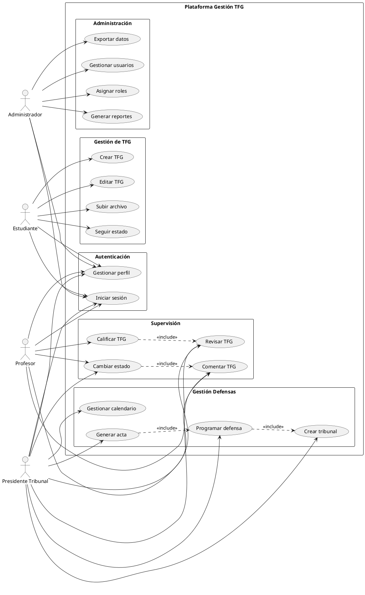
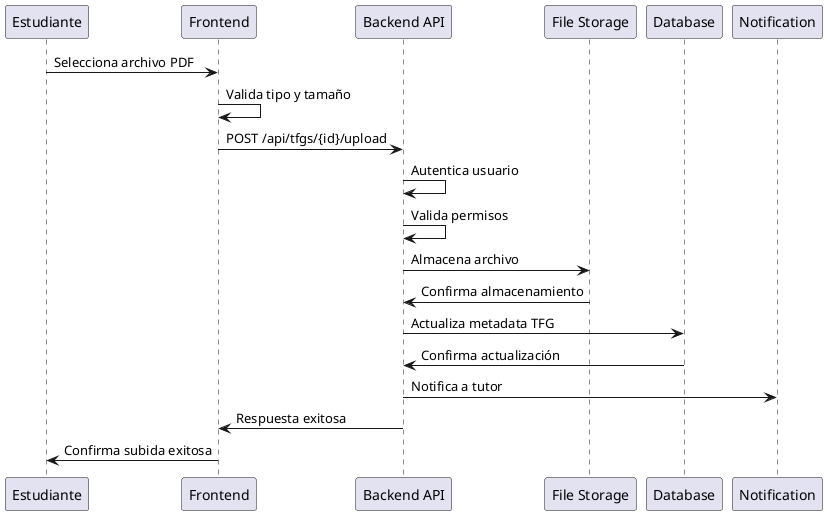
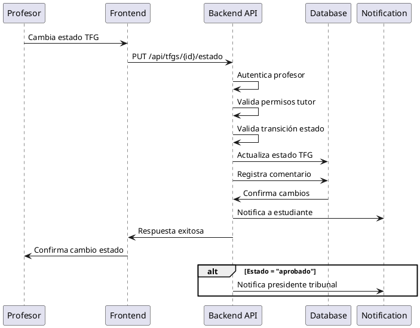
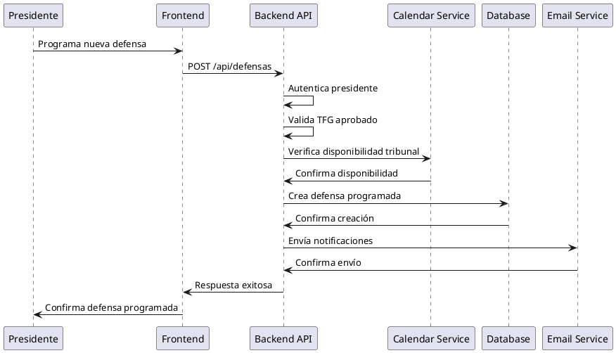

# 4. Análisis del sistema

## 4.1. Especificación de requisitos

La especificación de requisitos de la Plataforma de Gestión de TFG se estructura siguiendo la metodología IEEE Std 830-1998, organizando los requisitos en categorías funcionales específicas por rol de usuario y requisitos no funcionales transversales que garantizan la calidad del sistema.

### 4.1.1. Requisitos de información

Los requisitos de información definen las entidades de datos principales que el sistema debe gestionar, sus atributos esenciales y las relaciones entre ellas.

#### 4.1.1.1. Entidad Usuario

**Descripción**: Representa a todos los actores que interactúan con el sistema, diferenciados por roles específicos.

**Atributos principales**:
- **Identificador único**: ID numérico autoincremental
- **Datos personales**: Nombre, apellidos, DNI, email, teléfono
- **Credenciales**: Email (único), password hash, fecha último acceso
- **Información académica**: Universidad, departamento, especialidad
- **Control de sistema**: Rol asignado, estado activo/inactivo, fechas de creación y actualización

**Restricciones**:
- El email debe ser único en el sistema
- El DNI debe seguir formato válido español
- Cada usuario debe tener al menos un rol asignado
- Los datos personales son obligatorios para activación de cuenta

#### 4.1.1.2. Entidad TFG

**Descripción**: Representa un Trabajo de Fin de Grado con toda su información asociada y ciclo de vida.

**Atributos principales**:
- **Identificador único**: ID numérico autoincremental
- **Información académica**: Título, descripción detallada, resumen ejecutivo
- **Metadatos**: Palabras clave (array JSON), área de conocimiento
- **Relaciones**: Estudiante asignado, tutor principal, cotutor opcional
- **Estado**: Enum (borrador, revision, aprobado, defendido)
- **Fechas**: Inicio, fin estimada, fin real, última modificación
- **Archivo**: Ruta, nombre original, tamaño, tipo MIME
- **Evaluación**: Calificación final, comentarios de evaluación

**Restricciones**:
- Un estudiante puede tener máximo un TFG activo
- El título debe ser único por estudiante
- El archivo debe ser formato PDF con tamaño máximo 50MB
- Las transiciones de estado deben seguir el flujo definido

#### 4.1.1.3. Entidad Tribunal

**Descripción**: Comisión evaluadora responsable de las defensas de TFG.

**Atributos principales**:
- **Identificador único**: ID numérico autoincremental
- **Información básica**: Nombre descriptivo, descripción opcional
- **Composición**: Presidente, secretario, vocal (referencias a usuarios)
- **Estado**: Activo/inactivo para programación de nuevas defensas
- **Metadatos**: Fechas de creación y actualización

**Restricciones**:
- Los tres miembros del tribunal deben ser usuarios con rol profesor o superior
- No puede haber miembros duplicados en un mismo tribunal
- Al menos el presidente debe tener rol PRESIDENTE_TRIBUNAL

#### 4.1.1.4. Entidad Defensa

**Descripción**: Evento de presentación y evaluación de un TFG ante un tribunal.

**Atributos principales**:
- **Identificador único**: ID numérico autoincremental
- **Relaciones**: TFG a defender, tribunal asignado
- **Programación**: Fecha y hora, duración estimada, aula asignada
- **Estado**: Programada, completada, cancelada
- **Documentación**: Observaciones, acta generada (ruta archivo)
- **Metadatos**: Fechas de creación y actualización

**Restricciones**:
- Un TFG solo puede tener una defensa activa
- La fecha de defensa debe ser posterior a la fecha actual
- El tribunal debe estar disponible en la fecha programada

### 4.1.2. Requisitos funcionales

Los requisitos funcionales se organizan por rol de usuario, definiendo las capacidades específicas que el sistema debe proporcionar a cada tipo de actor.

#### 4.1.2.1. Requisitos funcionales - Estudiante

**RF-EST-001: Gestión de cuenta de usuario**
- **Descripción**: El estudiante debe poder visualizar y actualizar su información personal
- **Entrada**: Datos personales (nombre, apellidos, teléfono, etc.)
- **Procesamiento**: Validación de formato y unicidad
- **Salida**: Confirmación de actualización exitosa
- **Prioridad**: Alta

**RF-EST-002: Creación de TFG**
- **Descripción**: El estudiante debe poder crear un nuevo TFG proporcionando información básica
- **Entrada**: Título, descripción, resumen, palabras clave, tutor seleccionado
- **Procesamiento**: Validación de datos, verificación de no duplicidad de título
- **Salida**: TFG creado en estado "borrador"
- **Prioridad**: Alta

**RF-EST-003: Edición de información de TFG**
- **Descripción**: El estudiante debe poder modificar la información de su TFG en estado borrador
- **Entrada**: Campos modificables del TFG
- **Procesamiento**: Validación de permisos de edición según estado
- **Salida**: TFG actualizado con nueva información
- **Prioridad**: Alta

**RF-EST-004: Upload de archivo TFG**
- **Descripción**: El estudiante debe poder subir el archivo PDF de su trabajo
- **Entrada**: Archivo PDF (máximo 50MB)
- **Procesamiento**: Validación de formato, tipo MIME, tamaño
- **Salida**: Archivo almacenado y vinculado al TFG
- **Prioridad**: Alta

**RF-EST-005: Seguimiento de estado**
- **Descripción**: El estudiante debe poder visualizar el estado actual y histórico de su TFG
- **Entrada**: ID del TFG del estudiante
- **Procesamiento**: Recuperación de información de estado y timeline
- **Salida**: Estado actual, fechas de cambios, comentarios asociados
- **Prioridad**: Media

**RF-EST-006: Visualización de comentarios**
- **Descripción**: El estudiante debe poder leer comentarios y feedback de su tutor
- **Entrada**: ID del TFG
- **Procesamiento**: Filtrado de comentarios visibles para el estudiante
- **Salida**: Lista de comentarios ordenados cronológicamente
- **Prioridad**: Media

**RF-EST-007: Consulta de información de defensa**
- **Descripción**: El estudiante debe poder ver detalles de su defensa programada
- **Entrada**: ID del TFG
- **Procesamiento**: Búsqueda de defensa asociada
- **Salida**: Fecha, hora, tribunal, aula, duración
- **Prioridad**: Media

#### 4.1.2.2. Requisitos funcionales - Profesor

**RF-PROF-001: Visualización de TFG asignados**
- **Descripción**: El profesor debe poder ver listado de TFG donde participa como tutor
- **Entrada**: ID del profesor
- **Procesamiento**: Filtrado de TFG por tutor_id o cotutor_id
- **Salida**: Lista de TFG con información resumida y estado
- **Prioridad**: Alta

**RF-PROF-002: Revisión de TFG**
- **Descripción**: El profesor debe poder descargar y revisar archivos de TFG asignados
- **Entrada**: ID del TFG, credenciales del profesor
- **Procesamiento**: Verificación de permisos, generación de enlace de descarga
- **Salida**: Archivo PDF descargable
- **Prioridad**: Alta

**RF-PROF-003: Gestión de comentarios**
- **Descripción**: El profesor debe poder agregar comentarios y feedback estructurado
- **Entrada**: ID del TFG, texto del comentario, tipo de comentario
- **Procesamiento**: Validación de permisos, almacenamiento del comentario
- **Salida**: Comentario registrado y notificación al estudiante
- **Prioridad**: Alta

**RF-PROF-004: Cambio de estado de TFG**
- **Descripción**: El profesor debe poder cambiar el estado de TFG bajo su supervisión
- **Entrada**: ID del TFG, nuevo estado, comentario justificativo
- **Procesamiento**: Validación de transición de estado permitida
- **Salida**: Estado actualizado y notificaciones automáticas
- **Prioridad**: Alta

**RF-PROF-005: Gestión de calificaciones**
- **Descripción**: El profesor debe poder asignar calificaciones a TFG defendidos
- **Entrada**: ID de la defensa, calificaciones por criterio, comentarios
- **Procesamiento**: Validación de rango de calificaciones, cálculo de nota final
- **Salida**: Calificación registrada y disponible para el estudiante
- **Prioridad**: Media

**RF-PROF-006: Participación en tribunales**
- **Descripción**: El profesor debe poder ver tribunales donde participa y defensas programadas
- **Entrada**: ID del profesor
- **Procesamiento**: Búsqueda de tribunales donde es miembro
- **Salida**: Lista de tribunales, defensas programadas, calendario
- **Prioridad**: Media

#### 4.1.2.3. Requisitos funcionales - Presidente de Tribunal

**RF-PRES-001: Gestión de tribunales**
- **Descripción**: El presidente debe poder crear, editar y gestionar tribunales
- **Entrada**: Información del tribunal, miembros seleccionados
- **Procesamiento**: Validación de roles, verificación de disponibilidad
- **Salida**: Tribunal creado/actualizado con miembros asignados
- **Prioridad**: Alta

**RF-PRES-002: Programación de defensas**
- **Descripción**: El presidente debe poder programar defensas en el calendario
- **Entrada**: TFG a defender, tribunal, fecha/hora, aula
- **Procesamiento**: Verificación de disponibilidad de tribunal y recursos
- **Salida**: Defensa programada con notificaciones automáticas
- **Prioridad**: Alta

**RF-PRES-003: Gestión de calendario**
- **Descripción**: El presidente debe poder visualizar y gestionar el calendario de defensas
- **Entrada**: Rango de fechas, filtros por tribunal
- **Procesamiento**: Agregación de datos de defensas programadas
- **Salida**: Vista de calendario con eventos de defensa
- **Prioridad**: Alta

**RF-PRES-004: Coordinación de disponibilidad**
- **Descripción**: El presidente debe poder consultar disponibilidad de miembros de tribunal
- **Entrada**: Tribunal seleccionado, rango de fechas
- **Procesamiento**: Cruce de calendarios de miembros
- **Salida**: Slots de tiempo disponibles para todos los miembros
- **Prioridad**: Media

**RF-PRES-005: Generación de actas**
- **Descripción**: El presidente debe poder generar actas de defensa en formato PDF
- **Entrada**: ID de la defensa completada
- **Procesamiento**: Agregación de datos, generación de documento
- **Salida**: Acta en formato PDF descargable
- **Prioridad**: Media

#### 4.1.2.4. Requisitos funcionales - Administrador

**RF-ADM-001: Gestión completa de usuarios**
- **Descripción**: El administrador debe poder realizar operaciones CRUD sobre usuarios
- **Entrada**: Datos de usuario, rol asignado
- **Procesamiento**: Validación de datos, gestión de permisos
- **Salida**: Usuario creado/actualizado/eliminado
- **Prioridad**: Alta

**RF-ADM-002: Asignación de roles**
- **Descripción**: El administrador debe poder modificar roles y permisos de usuarios
- **Entrada**: ID de usuario, nuevo rol
- **Procesamiento**: Validación de permisos, actualización de privilegios
- **Salida**: Rol actualizado con permisos correspondientes
- **Prioridad**: Alta

**RF-ADM-003: Generación de reportes**
- **Descripción**: El administrador debe poder generar reportes estadísticos del sistema
- **Entrada**: Tipo de reporte, filtros temporales, parámetros
- **Procesamiento**: Agregación de datos, cálculos estadísticos
- **Salida**: Reporte con gráficos y métricas
- **Prioridad**: Media

**RF-ADM-004: Exportación de datos**
- **Descripción**: El administrador debe poder exportar datos en múltiples formatos
- **Entrada**: Conjunto de datos seleccionado, formato de exportación
- **Procesamiento**: Serialización de datos según formato
- **Salida**: Archivo exportado (PDF, Excel, CSV)
- **Prioridad**: Media

**RF-ADM-005: Configuración del sistema**
- **Descripción**: El administrador debe poder configurar parámetros globales
- **Entrada**: Parámetros de configuración
- **Procesamiento**: Validación de valores, actualización de configuración
- **Salida**: Configuración actualizada en el sistema
- **Prioridad**: Baja

### 4.1.3. Diagrama de casos de uso

El siguiente diagrama representa las principales interacciones entre los actores del sistema y las funcionalidades disponibles para cada rol.

### 4.1.4. Descripción de casos de uso

#### 4.1.4.1. UC001 - Crear TFG

**Actor principal**: Estudiante  
**Precondiciones**: 
- El usuario está autenticado con rol estudiante
- El estudiante no tiene un TFG activo

**Flujo principal**:
1. El estudiante accede a la opción "Nuevo TFG"
2. El sistema muestra el formulario de creación
3. El estudiante completa título, descripción, resumen y palabras clave
4. El estudiante selecciona un tutor de la lista disponible
5. El estudiante confirma la creación
6. El sistema valida la información proporcionada
7. El sistema crea el TFG en estado "borrador"
8. El sistema notifica al tutor seleccionado

**Flujos alternativos**:
- **6a**: Si la validación falla, el sistema muestra errores específicos
- **7a**: Si el estudiante ya tiene un TFG activo, el sistema rechaza la operación

**Postcondiciones**:
- Se crea un nuevo TFG en estado "borrador"
- El tutor recibe notificación de asignación

#### 4.1.4.2. UC005 - Revisar TFG

**Actor principal**: Profesor  
**Precondiciones**: 
- El usuario está autenticado con rol profesor
- El TFG está asignado al profesor como tutor

**Flujo principal**:
1. El profesor accede a su lista de TFG asignados
2. El profesor selecciona un TFG específico
3. El sistema muestra detalles del TFG
4. El profesor descarga el archivo PDF si está disponible
5. El profesor revisa el contenido del trabajo

**Flujos alternativos**:
- **4a**: Si no hay archivo subido, el sistema informa de la situación
- **2a**: Si el TFG no está asignado al profesor, el sistema deniega acceso

**Postcondiciones**:
- El profesor tiene acceso al contenido del TFG para evaluación

#### 4.1.4.3. UC010 - Programar defensa

**Actor principal**: Presidente de Tribunal  
**Precondiciones**: 
- El usuario está autenticado con rol presidente de tribunal
- Existe al menos un tribunal creado
- El TFG está en estado "aprobado"

**Flujo principal**:
1. El presidente accede al calendario de defensas
2. El presidente selecciona un TFG aprobado para programar
3. El sistema muestra opciones de tribunales disponibles
4. El presidente selecciona tribunal, fecha, hora y aula
5. El sistema verifica disponibilidad de todos los miembros
6. El presidente confirma la programación
7. El sistema crea la defensa programada
8. El sistema envía notificaciones a estudiante y miembros del tribunal

**Flujos alternativos**:
- **5a**: Si hay conflictos de disponibilidad, el sistema sugiere alternativas
- **4a**: Si no hay tribunales disponibles, el sistema solicita crear uno

**Postcondiciones**:
- Se programa una defensa con fecha y tribunal asignados
- Todos los involucrados reciben notificaciones

### 4.1.5. Diagramas de secuencia

#### 4.1.5.1. Secuencia: Subida de archivo TFG

#### 4.1.5.2. Secuencia: Cambio de estado de TFG

#### 4.1.5.3. Secuencia: Programación de defensa

### 4.1.6. Requisitos no funcionales

#### 4.1.6.1. Rendimiento

**RNF-001: Tiempo de respuesta**
- **Descripción**: Las operaciones críticas deben completarse en tiempo óptimo
- **Criterio**: 
  - Login y autenticación: < 2 segundos
  - Carga de páginas principales: < 3 segundos  
  - Upload de archivos (50MB): < 30 segundos
  - Generación de reportes: < 10 segundos
- **Prioridad**: Alta

**RNF-002: Throughput**
- **Descripción**: El sistema debe soportar carga concurrente de usuarios
- **Criterio**: 100 usuarios concurrentes sin degradación de rendimiento
- **Prioridad**: Media

**RNF-003: Escalabilidad**
- **Descripción**: Capacidad de crecimiento con aumento de usuarios
- **Criterio**: Arquitectura preparada para escalado horizontal
- **Prioridad**: Media

#### 4.1.6.2. Seguridad

**RNF-004: Autenticación**
- **Descripción**: Control de acceso seguro basado en JWT
- **Criterio**: 
  - Tokens con expiración de 1 hora
  - Refresh tokens con rotación
  - Logout que invalida tokens
- **Prioridad**: Alta

**RNF-005: Autorización**
- **Descripción**: Control granular de permisos por rol
- **Criterio**: Verificación de permisos en cada operación sensible
- **Prioridad**: Alta

**RNF-006: Protección de datos**
- **Descripción**: Cumplimiento de RGPD para datos personales
- **Criterio**: 
  - Cifrado de datos sensibles
  - Logs de auditoría
  - Políticas de retención
- **Prioridad**: Alta

#### 4.1.6.3. Usabilidad

**RNF-007: Interfaz intuitiva**
- **Descripción**: Facilidad de uso para usuarios no técnicos
- **Criterio**: Curva de aprendizaje < 30 minutos para operaciones básicas
- **Prioridad**: Alta

**RNF-008: Responsive design**
- **Descripción**: Adaptabilidad a diferentes dispositivos
- **Criterio**: Funcionalidad completa en desktop, tablet y móvil
- **Prioridad**: Media

**RNF-009: Accesibilidad**
- **Descripción**: Cumplimiento de estándares de accesibilidad
- **Criterio**: Nivel AA de WCAG 2.1
- **Prioridad**: Media

#### 4.1.6.4. Confiabilidad

**RNF-010: Disponibilidad**
- **Descripción**: Sistema disponible durante horario académico
- **Criterio**: 99.5% uptime en horario académico (8:00-20:00)
- **Prioridad**: Alta

**RNF-011: Recuperación de errores**
- **Descripción**: Capacidad de recuperación ante fallos
- **Criterio**: RTO < 4 horas, RPO < 1 hora
- **Prioridad**: Media

**RNF-012: Consistencia de datos**
- **Descripción**: Integridad y consistencia de información
- **Criterio**: Transacciones ACID, validación de integridad referencial
- **Prioridad**: Alta

## 4.2. Garantía de calidad

### 4.2.1. Seguridad

La seguridad del sistema se implementa mediante múltiples capas de protección que abarcan desde la autenticación hasta la protección de datos en tránsito y reposo.

#### 4.2.1.1. Autenticación y autorización

**Sistema JWT implementado**:
- **Access tokens**: Duración de 1 hora con payload mínimo (ID usuario, roles, timestamp)
- **Refresh tokens**: Duración de 30 días con rotación automática en cada uso
- **Algoritmo de firma**: RS256 con claves asimétricas para máxima seguridad
- **Revocación**: Lista negra de tokens comprometidos con limpieza automática

**Control de acceso basado en roles (RBAC)**:
- **Jerarquía de roles**: ADMIN > PRESIDENTE_TRIBUNAL > PROFESOR > ESTUDIANTE
- **Permisos granulares**: Verificación a nivel de endpoint y recurso específico
- **Validación doble**: Frontend para UX, backend para seguridad crítica

#### 4.2.1.2. Protección de datos

**Cifrado de datos**:
- **En tránsito**: HTTPS/TLS 1.3 obligatorio en producción
- **En reposo**: Cifrado AES-256 para campos sensibles (passwords, datos personales)
- **Archivos PDF**: Almacenamiento seguro con URLs firmadas temporalmente

**Validación y sanitización**:
- **Input validation**: Validación estricta en backend para todos los inputs
- **SQL injection**: Uso exclusivo de prepared statements con Doctrine ORM
- **XSS protection**: Sanitización automática en frontend y CSP headers
- **File upload**: Validación de tipo MIME, tamaño y escaneo de malware

#### 4.2.1.3. Auditoría y logs

**Sistema de logs implementado**:
- **Eventos de seguridad**: Login, logout, cambios de permisos, accesos denegados
- **Operaciones críticas**: Cambios de estado TFG, uploads, modificaciones de usuarios
- **Retención**: Logs conservados 12 meses con rotación automática
- **Alertas**: Notificaciones automáticas para patrones de actividad sospechosa

### 4.2.2. Interoperabilidad

#### 4.2.2.1. APIs REST estándar

**Diseño RESTful**:
- **Recursos bien definidos**: URLs descriptivas siguiendo convenciones REST
- **Métodos HTTP apropiados**: GET (lectura), POST (creación), PUT (actualización), DELETE (eliminación)
- **Códigos de estado consistentes**: 200 (OK), 201 (Created), 400 (Bad Request), 401 (Unauthorized), 403 (Forbidden), 404 (Not Found), 500 (Internal Error)
- **Content negotiation**: Soporte para JSON con posibilidad de extensión a XML

**Documentación automática**:
- **OpenAPI 3.0**: Especificación completa generada automáticamente por API Platform
- **Swagger UI**: Interface interactiva para testing y exploración de APIs
- **Postman collections**: Colecciones exportables para testing automatizado

#### 4.2.2.2. Formato de datos estándar

**Serialización JSON**:
- **HAL+JSON**: Links hipermedia para navegabilidad de recursos relacionados
- **Paginación**: Metadata estándar con total, página actual, enlaces siguiente/anterior
- **Filtrado**: Query parameters consistentes para búsqueda y filtrado
- **Versionado**: Headers de versión para evolución de APIs sin breaking changes

### 4.2.3. Operabilidad

#### 4.2.3.1. Monitorización

**Métricas de aplicación**:
- **Performance**: Tiempo de respuesta por endpoint, throughput, latencia P95/P99
- **Errores**: Rate de errores, tipos de error más frecuentes, stack traces
- **Uso**: Usuarios activos, operaciones más utilizadas, patrones de uso

**Health checks**:
- **Endpoint /health**: Estado de la aplicación, base de datos, servicios externos
- **Métricas de infraestructura**: CPU, memoria, disco, conexiones de BD
- **Alertas proactivas**: Notificaciones antes de que los problemas afecten usuarios

#### 4.2.3.2. Mantenibilidad

**Arquitectura limpia**:
- **Separación de responsabilidades**: Capas bien definidas (presentación, lógica, persistencia)
- **Dependency injection**: Inversión de control para testing y flexibilidad
- **Principios SOLID**: Código mantenible y extensible

**Documentación técnica**:
- **README actualizado**: Instrucciones de instalación, configuración, desarrollo
- **Comentarios en código**: Documentación inline para lógica compleja
- **Architectural Decision Records (ADR)**: Registro de decisiones técnicas importantes

### 4.2.4. Transferibilidad

#### 4.2.4.1. Containerización

**Docker para desarrollo**:
- **DDEV**: Entorno de desarrollo reproducible con Docker
- **Servicios aislados**: Web, base de datos, email, cache en contenedores separados
- **Configuración compartida**: docker-compose.yml versionado en repositorio

**Preparación para producción**:
- **Multistage builds**: Imágenes optimizadas para producción
- **Environment variables**: Configuración externalizada para diferentes entornos
- **Health checks**: Verificaciones de salud integradas en contenedores

#### 4.2.4.2. Despliegue automatizado

**CI/CD Pipeline**:
- **GitHub Actions**: Automatización de testing, build y deploy
- **Testing automatizado**: Ejecución de tests unitarios e integración en cada commit
- **Deploy scripts**: Automatización de despliegue a diferentes entornos

### 4.2.5. Eficiencia

#### 4.2.5.1. Optimización frontend

**React performance**:
- **Code splitting**: Carga lazy de componentes por ruta
- **Memoization**: useMemo y useCallback para optimizar re-renders
- **Virtual scrolling**: Para listas largas de TFGs o usuarios
- **Bundle optimization**: Tree shaking y minificación con Vite

**Caching estratégico**:
- **Browser caching**: Headers apropiados para assets estáticos
- **React Query**: Caching inteligente de datos de APIs
- **Service Workers**: Cache offline para funcionalidad básica

#### 4.2.5.2. Optimización backend

**Base de datos**:
- **Índices optimizados**: Índices compuestos para queries frecuentes
- **Query optimization**: Análisis de explain plans, evitar N+1 queries
- **Connection pooling**: Gestión eficiente de conexiones de BD
- **Lazy loading**: Carga diferida de relaciones no críticas

**API optimization**:
- **Response compression**: Gzip para reducir payload
- **Pagination**: Limitación de resultados para evitar respuestas masivas
- **Field selection**: Permitir especificar campos requeridos en responses
- **Rate limiting**: Prevención de abuso con limitación de requests

### 4.2.6. Mantenibilidad

#### 4.2.6.1. Calidad de código

**Estándares de codificación**:
- **ESLint + Prettier**: Formateo automático y reglas de calidad JavaScript
- **PHP CS Fixer**: Estándares PSR-12 para código PHP
- **PHPStan**: Análisis estático nivel 8 para detección temprana de errores
- **Conventional commits**: Mensajes de commit estructurados para changelog automático

**Testing estratégico**:
- **Unit tests**: 80%+ coverage para lógica de negocio crítica
- **Integration tests**: Validación de APIs y flujos completos
- **E2E tests**: Casos de usuario críticos automatizados
- **Visual regression**: Detección de cambios no intencionados en UI

#### 4.2.6.2. Arquitectura mantenible

**Patrones de diseño**:
- **Repository pattern**: Abstracción de persistencia de datos
- **Factory pattern**: Creación de objetos complejos
- **Observer pattern**: Sistema de eventos para notificaciones
- **Strategy pattern**: Diferentes estrategias de validación y procesamiento

## 4.3. Gestión del presupuesto

### 4.3.1. Estructura de costos

El proyecto se desarrolla en modalidad académica con recursos principalmente de tiempo de desarrollo, herramientas open source y servicios gratuitos para educación.

#### 4.3.1.1. Costos de desarrollo

**Tiempo de desarrollo**:
- **Total estimado**: 400 horas de desarrollo durante 10 semanas
- **Distribución semanal**: 40 horas/semana promedio con picos en fases críticas
- **Valor hora de desarrollo junior**: €15/hora (referencia mercado)
- **Costo total de desarrollo**: €6,000 (estimación teórica)

**Fases con mayor intensidad**:
- Fase 7 (Backend Symfony): 80 horas
- Fase 3-4 (Módulos usuario): 120 horas
- Fase 8 (Testing y deploy): 60 horas

#### 4.3.1.2. Infraestructura y herramientas

**Herramientas de desarrollo** (gratuitas para estudiantes):
- **GitHub Education Pack**: Repositorio privado, GitHub Actions gratuitas
- **DDEV**: Herramienta open source gratuita
- **VS Code**: IDE gratuito con extensiones
- **Draw.io**: Diagramas UML gratuitos

**Infraestructura de desarrollo**:
- **Desarrollo local**: Sin costo (máquina personal)
- **Base de datos**: MySQL en contenedor local
- **Testing**: Servicios locales con DDEV

#### 4.3.1.3. Costos de producción estimados

**Hosting y dominio** (mensual):
- **VPS básico**: €10-20/mes (2GB RAM, 1 CPU, 40GB SSD)
- **Dominio**: €10/año
- **Certificado SSL**: Gratuito (Let's Encrypt)
- **Email transaccional**: €0 (hasta 100 emails/día con servicios gratuitos)

**Escalabilidad futura**:
- **CDN**: €0-5/mes (Cloudflare free tier)
- **Backup**: €5-10/mes (almacenamiento cloud)
- **Monitoring**: €0-15/mes (New Relic, DataDog tier gratuito)

### 4.3.2. Return on Investment (ROI)

#### 4.3.2.1. Beneficios cuantificables

**Ahorro en tiempo administrativo**:
- **Gestión manual actual**: 2 horas/TFG por administrativo
- **TFG procesados anualmente**: 200 (estimación universidad media)
- **Ahorro total**: 400 horas/año
- **Valor por hora administrativa**: €20/hora
- **Ahorro anual**: €8,000

**Reducción de errores**:
- **Errores manuales**: 5% de TFG con errores de proceso
- **Costo promedio de corrección**: €50 por error
- **Ahorro en correcciones**: €500/año

#### 4.3.2.2. Beneficios intangibles

**Mejora en satisfacción**:
- **Estudiantes**: Mayor transparencia y seguimiento en tiempo real
- **Profesores**: Herramientas digitales que facilitan supervisión
- **Administración**: Reporting automático y métricas precisas

**Modernización académica**:
- **Imagen institucional**: Universidad tecnológicamente avanzada
- **Preparación futura**: Base para expansión a otros procesos académicos
- **Competitividad**: Ventaja frente a instituciones con procesos manuales

### 4.3.3. Análisis de viabilidad económica

#### 4.3.3.1. Punto de equilibrio

**Inversión inicial**: €6,000 (desarrollo) + €200 (infraestructura año 1) = €6,200  
**Ahorro anual**: €8,500 (tiempo + errores)  
**Tiempo de recuperación**: 8.7 meses

**Proyección a 3 años**:
- **Inversión total**: €6,200 + (€300 × 3 años) = €7,100
- **Ahorros totales**: €8,500 × 3 = €25,500
- **ROI**: 259% en 3 años

#### 4.3.3.2. Análisis de sensibilidad

**Escenario conservador** (50% de beneficios estimados):
- **Ahorro anual**: €4,250
- **ROI**: 79% en 3 años

**Escenario optimista** (expansión a otros procesos):
- **Ahorro anual**: €15,000 (incluyendo otros procesos académicos)
- **ROI**: 534% en 3 años

La viabilidad económica es positiva en todos los escenarios analizados, con recuperación de inversión en menos de 1 año en el escenario base.

---

*Fecha de elaboración: 31 de agosto de 2025*  
*Versión: 1.0*  
*Estándar: ISO/IEEE 16326:2009*