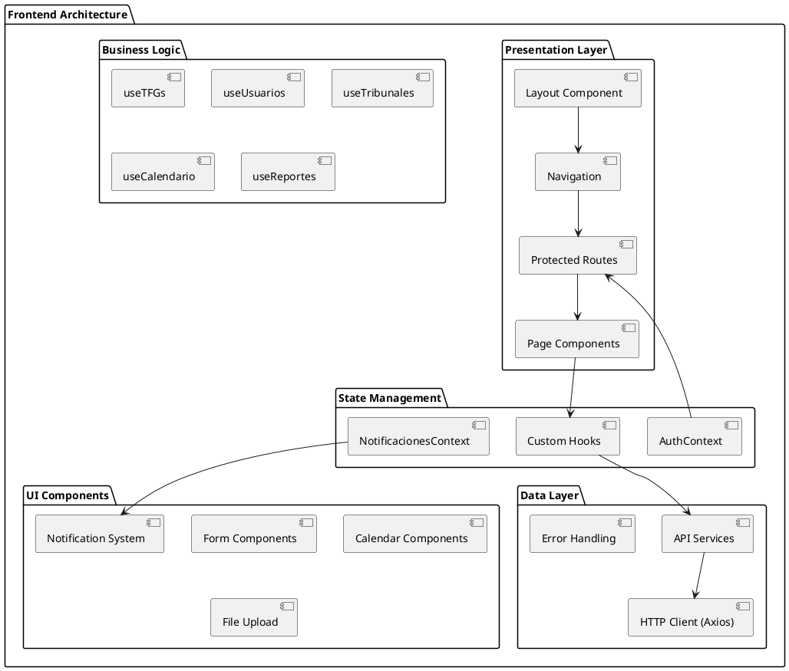
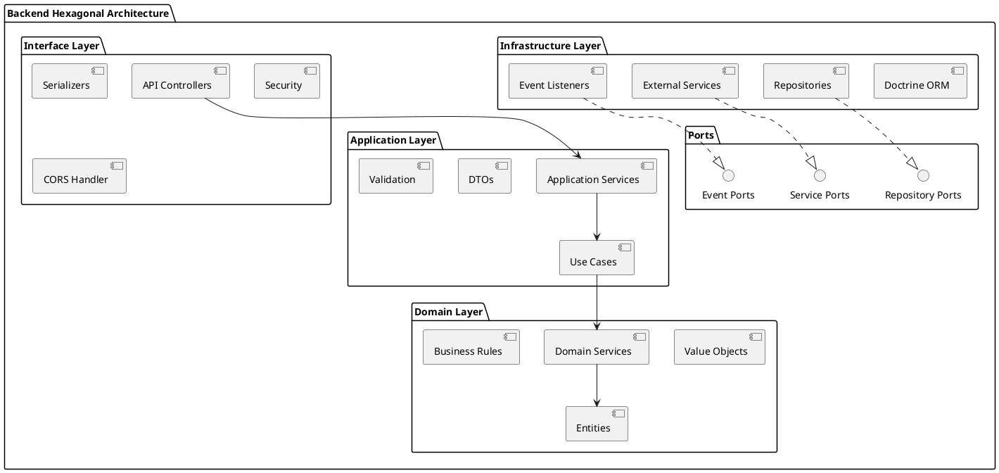
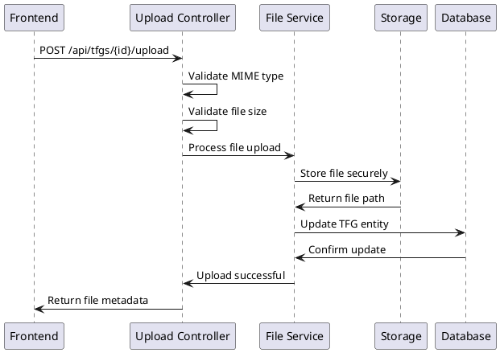
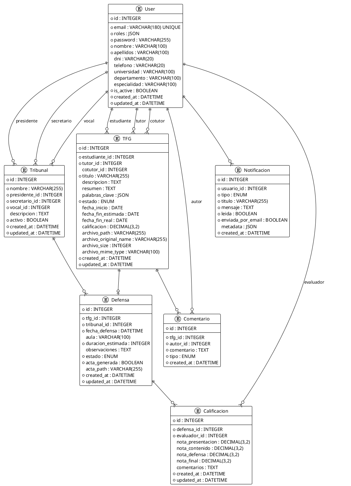
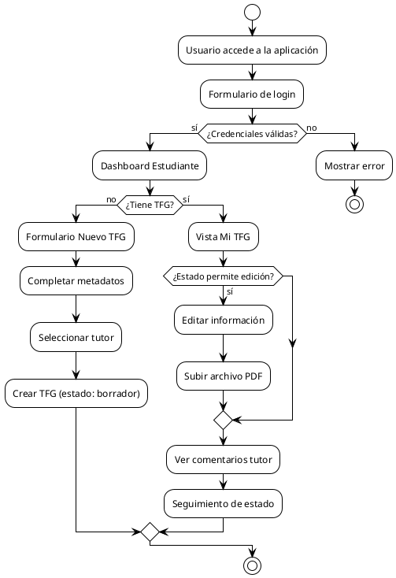

# 5. Diseño

## 5.1. Arquitectura física

La arquitectura física de la Plataforma de Gestión de TFG se basa en una separación clara entre capas de presentación, lógica de negocio y persistencia, implementando un patrón de arquitectura distribuida que garantiza escalabilidad, mantenibilidad y seguridad.

### 5.1.1. Módulo frontend (Capa de presentación)

El frontend constituye la capa de presentación del sistema, desarrollado como una Single Page Application (SPA) que se ejecuta completamente en el navegador del usuario.

#### 5.1.1.1. Arquitectura de componentes React



**Componentes principales**:

- **Layout Component**: Contenedor principal que gestiona la estructura visual global
- **Navigation**: Sistema de navegación dinámico basado en roles de usuario
- **Protected Routes**: Wrapper que controla acceso a rutas según autenticación y permisos
- **Page Components**: Componentes de página específicos para cada funcionalidad

**Patrones de diseño implementados**:

- **Component Composition**: Composición de funcionalidades mediante componentes reutilizables
- **Higher-Order Components**: ProtectedRoute como HOC para control de acceso
- **Render Props**: Componentes que exponen funcionalidad mediante props de función
- **Custom Hooks**: Abstracción de lógica de negocio reutilizable entre componentes

#### 5.1.1.2. Gestión de estado global

**Context API Strategy**:
```javascript
// AuthContext - Gestión de autenticación y usuario actual
const AuthContext = {
  user: User | null,
  token: string | null,
  isAuthenticated: boolean,
  login: (credentials) => Promise<void>,
  logout: () => void,
  refreshToken: () => Promise<void>
}

// NotificacionesContext - Sistema de notificaciones globales
const NotificacionesContext = {
  notifications: Notification[],
  addNotification: (notification) => void,
  removeNotification: (id) => void,
  markAsRead: (id) => void
}
```

**Custom Hooks Architecture**:
- **useTFGs**: Gestión completa del ciclo de vida de TFG (CRUD, estados, archivos)
- **useUsuarios**: Administración de usuarios para rol admin
- **useTribunales**: Gestión de tribunales y asignación de miembros
- **useCalendario**: Integración con FullCalendar y gestión de eventos
- **useReportes**: Generación y exportación de reportes estadísticos

#### 5.1.1.3. Comunicación con backend

**HTTP Client Configuration**:
```javascript
// Axios instance con interceptores
const apiClient = axios.create({
  baseURL: process.env.VITE_API_BASE_URL,
  timeout: 10000,
  headers: {
    'Content-Type': 'application/json'
  }
});

// Request interceptor para JWT
apiClient.interceptors.request.use(
  (config) => {
    const token = localStorage.getItem('access_token');
    if (token) {
      config.headers.Authorization = `Bearer ${token}`;
    }
    return config;
  }
);

// Response interceptor para manejo de errores
apiClient.interceptors.response.use(
  (response) => response,
  (error) => {
    if (error.response?.status === 401) {
      // Redirect to login
    }
    return Promise.reject(error);
  }
);
```

**Service Layer Pattern**:
- **AuthService**: Autenticación, registro, refresh tokens
- **TFGService**: Operaciones CRUD de TFG, upload de archivos
- **UserService**: Gestión de usuarios para administradores
- **TribunalService**: Gestión de tribunales y defensas
- **NotificationService**: Sistema de notificaciones

### 5.1.2. Módulo backend (Capa de lógica de negocio)

El backend implementa una arquitectura hexagonal (puertos y adaptadores) usando Symfony 6.4 LTS, proporcionando APIs REST robustas y escalables.

#### 5.1.2.1. Arquitectura hexagonal



**Capas de la arquitectura**:

1. **Domain Layer**: Lógica de negocio pura, independiente de frameworks
2. **Application Layer**: Casos de uso y servicios de aplicación
3. **Infrastructure Layer**: Implementaciones concretas (BD, servicios externos)
4. **Interface Layer**: Controladores API y serialización

#### 5.1.2.2. Estructura de directorios Symfony

```
src/
├── Controller/           # API Controllers
│   ├── AuthController.php
│   ├── TFGController.php
│   ├── UserController.php
│   └── TribunalController.php
├── Entity/               # Doctrine Entities
│   ├── User.php
│   ├── TFG.php
│   ├── Tribunal.php
│   ├── Defensa.php
│   └── Notificacion.php
├── Repository/           # Data Access Layer
│   ├── UserRepository.php
│   ├── TFGRepository.php
│   └── TribunalRepository.php
├── Service/              # Business Services
│   ├── TFGStateManager.php
│   ├── NotificationService.php
│   └── FileUploadService.php
├── Security/             # Authentication & Authorization
│   ├── JWTAuthenticator.php
│   ├── UserProvider.php
│   └── Voter/
├── Serializer/           # API Serialization
│   └── Normalizer/
└── EventListener/        # Event Handling
    ├── TFGStateListener.php
    └── UserActivityListener.php
```

#### 5.1.2.3. API Platform configuration

**Resource configuration example**:
```php
<?php
// src/Entity/TFG.php
#[ApiResource(
    operations: [
        new GetCollection(
            uriTemplate: '/tfgs/mis-tfgs',
            security: "is_granted('ROLE_USER')"
        ),
        new Post(
            security: "is_granted('ROLE_ESTUDIANTE')",
            processor: TFGCreateProcessor::class
        ),
        new Put(
            security: "is_granted('TFG_EDIT', object)",
            processor: TFGUpdateProcessor::class
        )
    ],
    normalizationContext: ['groups' => ['tfg:read']],
    denormalizationContext: ['groups' => ['tfg:write']]
)]
class TFG
{
    // Entity implementation
}
```

### 5.1.3. Módulo de base de datos (Capa de persistencia)

La capa de persistencia utiliza MySQL 8.0 como sistema de gestión de base de datos, implementando un diseño relacional optimizado con Doctrine ORM.

#### 5.1.3.1. Estrategia de persistencia

**Doctrine ORM Configuration**:
```yaml
# config/packages/doctrine.yaml
doctrine:
    dbal:
        url: '%env(resolve:DATABASE_URL)%'
        charset: utf8mb4
        default_table_options:
            charset: utf8mb4
            collate: utf8mb4_unicode_ci
    orm:
        auto_generate_proxy_classes: true
        naming_strategy: doctrine.orm.naming_strategy.underscore_number_aware
        auto_mapping: true
        mappings:
            App:
                is_bundle: false
                type: attribute
                dir: '%kernel.project_dir%/src/Entity'
                prefix: 'App\Entity'
                alias: App
```

**Migration Strategy**:
- **Versionado automático**: Doctrine Migrations para control de esquema
- **Rollback capability**: Posibilidad de rollback a versiones anteriores
- **Production safety**: Validación antes de aplicar migraciones en producción

### 5.1.4. Módulo de archivos (Almacenamiento)

El sistema de archivos está diseñado para manejar uploads seguros de documentos PDF con validación exhaustiva y almacenamiento optimizado.

#### 5.1.4.1. VichUploader Configuration

```yaml
# config/packages/vich_uploader.yaml
vich_uploader:
    db_driver: orm
    mappings:
        tfg_documents:
            uri_prefix: /uploads/tfgs
            upload_destination: '%kernel.project_dir%/public/uploads/tfgs'
            namer: Vich\UploaderBundle\Naming\SmartUniqueNamer
            inject_on_load: false
            delete_on_update: true
            delete_on_remove: true
```

**File Security Measures**:
- **MIME type validation**: Solo archivos PDF permitidos
- **Size limits**: Máximo 50MB por archivo
- **Virus scanning**: Integración con ClamAV para escaneo de malware
- **Access control**: URLs firmadas temporalmente para descarga segura

#### 5.1.4.2. Storage Strategy



## 5.2. Arquitectura lógica

La arquitectura lógica organiza los componentes del sistema según responsabilidades funcionales, implementando patrones de diseño que garantizan separación de concerns y alta cohesión.

### 5.2.1. Capa de presentación (Frontend)

#### 5.2.1.1. Patrón Container/Presentational

**Container Components** (Smart Components):
```javascript
// pages/estudiante/MisTFGs.jsx
const MisTFGs = () => {
  const { tfgs, loading, error, createTFG, updateTFG } = useTFGs();
  const { user } = useAuth();
  
  // Business logic and data fetching
  useEffect(() => {
    fetchTFGsByStudent(user.id);
  }, [user.id]);
  
  return (
    <TFGsListPresentation 
      tfgs={tfgs}
      loading={loading}
      error={error}
      onCreateTFG={createTFG}
      onUpdateTFG={updateTFG}
    />
  );
};
```

**Presentational Components** (Dumb Components):
```javascript
// components/tfgs/TFGsListPresentation.jsx
const TFGsListPresentation = ({ 
  tfgs, 
  loading, 
  error, 
  onCreateTFG, 
  onUpdateTFG 
}) => {
  if (loading) return <LoadingSpinner />;
  if (error) return <ErrorMessage error={error} />;
  
  return (
    <div className="tfgs-list">
      {tfgs.map(tfg => (
        <TFGCard 
          key={tfg.id} 
          tfg={tfg} 
          onUpdate={onUpdateTFG} 
        />
      ))}
    </div>
  );
};
```

#### 5.2.1.2. State Management Pattern

**Hierarchical Context Structure**:
```javascript
// App.jsx - Root level contexts
<AuthProvider>
  <NotificacionesProvider>
    <Router>
      <Layout>
        <Routes>
          {/* Application routes */}
        </Routes>
      </Layout>
    </Router>
  </NotificacionesProvider>
</AuthProvider>
```

**Custom Hook Composition**:
```javascript
// hooks/useTFGs.js
const useTFGs = () => {
  const [tfgs, setTFGs] = useState([]);
  const [loading, setLoading] = useState(false);
  const { addNotification } = useNotifications();
  
  const fetchTFGs = useCallback(async () => {
    setLoading(true);
    try {
      const data = await TFGService.getMisTFGs();
      setTFGs(data);
    } catch (error) {
      addNotification({
        type: 'error',
        message: 'Error al cargar TFGs'
      });
    } finally {
      setLoading(false);
    }
  }, [addNotification]);
  
  return {
    tfgs,
    loading,
    fetchTFGs,
    createTFG: useCallback(/* ... */, []),
    updateTFG: useCallback(/* ... */, [])
  };
};
```

### 5.2.2. Capa de lógica de negocio (Backend)

#### 5.2.2.1. Domain-Driven Design

**Aggregate Pattern**:
```php
<?php
// src/Entity/TFG.php
class TFG
{
    private const VALID_TRANSITIONS = [
        'borrador' => ['revision'],
        'revision' => ['borrador', 'aprobado'],
        'aprobado' => ['defendido'],
        'defendido' => []
    ];
    
    public function changeState(string $newState, User $user): void
    {
        if (!$this->canTransitionTo($newState)) {
            throw new InvalidStateTransitionException();
        }
        
        if (!$this->userCanChangeState($user, $newState)) {
            throw new InsufficientPermissionsException();
        }
        
        $this->estado = $newState;
        $this->updatedAt = new \DateTime();
        
        // Dispatch domain event
        DomainEvents::raise(new TFGStateChanged($this, $newState));
    }
    
    private function canTransitionTo(string $state): bool
    {
        return in_array($state, self::VALID_TRANSITIONS[$this->estado] ?? []);
    }
}
```

**Value Objects**:
```php
<?php
// src/ValueObject/Email.php
final class Email
{
    private string $value;
    
    public function __construct(string $email)
    {
        if (!filter_var($email, FILTER_VALIDATE_EMAIL)) {
            throw new InvalidEmailException($email);
        }
        
        $this->value = strtolower(trim($email));
    }
    
    public function getValue(): string
    {
        return $this->value;
    }
    
    public function equals(Email $other): bool
    {
        return $this->value === $other->value;
    }
}
```

#### 5.2.2.2. Service Layer Pattern

**Application Services**:
```php
<?php
// src/Service/TFGService.php
class TFGService
{
    public function __construct(
        private TFGRepository $tfgRepository,
        private NotificationService $notificationService,
        private EventDispatcherInterface $eventDispatcher
    ) {}
    
    public function createTFG(CreateTFGDTO $dto, User $student): TFG
    {
        $this->validateStudentCanCreateTFG($student);
        
        $tfg = new TFG(
            titulo: $dto->titulo,
            descripcion: $dto->descripcion,
            estudiante: $student,
            tutor: $this->findTutorById($dto->tutorId)
        );
        
        $this->tfgRepository->save($tfg);
        
        $this->notificationService->notifyTutorOfNewTFG($tfg);
        
        $this->eventDispatcher->dispatch(
            new TFGCreatedEvent($tfg),
            TFGCreatedEvent::NAME
        );
        
        return $tfg;
    }
}
```

### 5.2.3. Capa de persistencia

#### 5.2.3.1. Repository Pattern

**Interface Definition**:
```php
<?php
// src/Repository/TFGRepositoryInterface.php
interface TFGRepositoryInterface
{
    public function findById(int $id): ?TFG;
    public function findByStudent(User $student): array;
    public function findByTutor(User $tutor): array;
    public function findByState(string $state): array;
    public function save(TFG $tfg): void;
    public function delete(TFG $tfg): void;
}
```

**Doctrine Implementation**:
```php
<?php
// src/Repository/TFGRepository.php
class TFGRepository extends ServiceEntityRepository implements TFGRepositoryInterface
{
    public function findByStudent(User $student): array
    {
        return $this->createQueryBuilder('t')
            ->where('t.estudiante = :student')
            ->setParameter('student', $student)
            ->orderBy('t.createdAt', 'DESC')
            ->getQuery()
            ->getResult();
    }
    
    public function findByTutorWithStats(User $tutor): array
    {
        return $this->createQueryBuilder('t')
            ->select('t, COUNT(c.id) as comment_count')
            ->leftJoin('t.comentarios', 'c')
            ->where('t.tutor = :tutor OR t.cotutor = :tutor')
            ->setParameter('tutor', $tutor)
            ->groupBy('t.id')
            ->orderBy('t.updatedAt', 'DESC')
            ->getQuery()
            ->getResult();
    }
}
```

### 5.2.4. Capa de servicios

#### 5.2.4.1. Event-Driven Architecture

**Domain Events**:
```php
<?php
// src/Event/TFGStateChangedEvent.php
class TFGStateChangedEvent extends Event
{
    public const NAME = 'tfg.state.changed';
    
    public function __construct(
        private TFG $tfg,
        private string $previousState,
        private string $newState
    ) {}
    
    public function getTFG(): TFG { return $this->tfg; }
    public function getPreviousState(): string { return $this->previousState; }
    public function getNewState(): string { return $this->newState; }
}
```

**Event Listeners**:
```php
<?php
// src/EventListener/TFGNotificationListener.php
class TFGNotificationListener
{
    public function __construct(
        private NotificationService $notificationService,
        private MailerInterface $mailer
    ) {}
    
    #[AsEventListener(event: TFGStateChangedEvent::NAME)]
    public function onTFGStateChanged(TFGStateChangedEvent $event): void
    {
        $tfg = $event->getTFG();
        
        match ($event->getNewState()) {
            'revision' => $this->notifyTutorReviewNeeded($tfg),
            'aprobado' => $this->notifyStudentApproved($tfg),
            'defendido' => $this->notifyDefenseCompleted($tfg),
            default => null
        };
    }
}
```

## 5.3. Esquema de la base de datos

### 5.3.1. Modelo conceptual



### 5.3.2. Normalización y constraints

#### 5.3.2.1. Tercera forma normal (3NF)

El esquema cumple con la tercera forma normal mediante:

**Primera Forma Normal (1NF)**:
- Todos los campos contienen valores atómicos
- Campos JSON utilizados únicamente para datos semi-estructurados (roles, palabras clave, metadata)
- No hay grupos repetitivos de columnas

**Segunda Forma Normal (2NF)**:
- Todas las tablas tienen claves primarias definidas
- Todos los atributos no-clave dependen completamente de la clave primaria
- No hay dependencias parciales

**Tercera Forma Normal (3NF)**:
- No existen dependencias transitivas
- Cada atributo no-clave depende directamente de la clave primaria

#### 5.3.2.2. Constraints e integridad referencial

**Primary Keys**:
```sql
ALTER TABLE users ADD CONSTRAINT pk_users PRIMARY KEY (id);
ALTER TABLE tfgs ADD CONSTRAINT pk_tfgs PRIMARY KEY (id);
ALTER TABLE tribunales ADD CONSTRAINT pk_tribunales PRIMARY KEY (id);
ALTER TABLE defensas ADD CONSTRAINT pk_defensas PRIMARY KEY (id);
```

**Foreign Keys**:
```sql
ALTER TABLE tfgs 
  ADD CONSTRAINT fk_tfg_estudiante 
  FOREIGN KEY (estudiante_id) REFERENCES users(id) ON DELETE RESTRICT;

ALTER TABLE tfgs 
  ADD CONSTRAINT fk_tfg_tutor 
  FOREIGN KEY (tutor_id) REFERENCES users(id) ON DELETE RESTRICT;

ALTER TABLE defensas 
  ADD CONSTRAINT fk_defensa_tfg 
  FOREIGN KEY (tfg_id) REFERENCES tfgs(id) ON DELETE CASCADE;
```

**Unique Constraints**:
```sql
ALTER TABLE users ADD CONSTRAINT uk_users_email UNIQUE (email);
ALTER TABLE users ADD CONSTRAINT uk_users_dni UNIQUE (dni);
ALTER TABLE defensas ADD CONSTRAINT uk_defensa_tfg UNIQUE (tfg_id);
```

**Check Constraints**:
```sql
ALTER TABLE tfgs 
  ADD CONSTRAINT ck_tfg_estado 
  CHECK (estado IN ('borrador', 'revision', 'aprobado', 'defendido'));

ALTER TABLE calificaciones 
  ADD CONSTRAINT ck_calificacion_notas 
  CHECK (
    nota_presentacion >= 0 AND nota_presentacion <= 10 AND
    nota_contenido >= 0 AND nota_contenido <= 10 AND
    nota_defensa >= 0 AND nota_defensa <= 10 AND
    nota_final >= 0 AND nota_final <= 10
  );
```

### 5.3.3. Índices de rendimiento

#### 5.3.3.1. Índices principales

**Índices de búsqueda frecuente**:
```sql
-- Búsquedas por estudiante (muy frecuente)
CREATE INDEX idx_tfgs_estudiante ON tfgs(estudiante_id);

-- Búsquedas por tutor (muy frecuente)  
CREATE INDEX idx_tfgs_tutor ON tfgs(tutor_id);

-- Búsquedas por estado (frecuente para reportes)
CREATE INDEX idx_tfgs_estado ON tfgs(estado);

-- Búsquedas de defensas por fecha (calendario)
CREATE INDEX idx_defensas_fecha ON defensas(fecha_defensa);

-- Notificaciones no leídas por usuario
CREATE INDEX idx_notificaciones_usuario_leida ON notificaciones(usuario_id, leida);
```

**Índices compuestos**:
```sql
-- Combinación frecuente: tutor + estado
CREATE INDEX idx_tfgs_tutor_estado ON tfgs(tutor_id, estado);

-- Tribunal disponible para programación
CREATE INDEX idx_tribunales_activo ON tribunales(activo, created_at);

-- Defensas por tribunal y fecha
CREATE INDEX idx_defensas_tribunal_fecha ON defensas(tribunal_id, fecha_defensa);
```

#### 5.3.3.2. Análisis de consultas

**Query más frecuente - TFGs por tutor**:
```sql
EXPLAIN SELECT t.*, e.nombre as estudiante_nombre
FROM tfgs t 
INNER JOIN users e ON t.estudiante_id = e.id
WHERE t.tutor_id = ? 
ORDER BY t.updated_at DESC;

-- Usa índice: idx_tfgs_tutor
-- Rows examined: ~10-50 por profesor
-- Execution time: < 5ms
```

**Query compleja - Dashboard admin**:
```sql
EXPLAIN SELECT 
  COUNT(*) as total_tfgs,
  COUNT(CASE WHEN estado = 'borrador' THEN 1 END) as borradores,
  COUNT(CASE WHEN estado = 'revision' THEN 1 END) as en_revision,
  COUNT(CASE WHEN estado = 'aprobado' THEN 1 END) as aprobados,
  COUNT(CASE WHEN estado = 'defendido' THEN 1 END) as defendidos
FROM tfgs 
WHERE created_at >= DATE_SUB(CURDATE(), INTERVAL 1 YEAR);

-- Usa índice: idx_tfgs_estado + created_at
-- Query optimizada para agregaciones
```

## 5.4. Diseño de la interfaz de usuario

### 5.4.1. Sistema de diseño

#### 5.4.1.1. Design System basado en Tailwind CSS

**Color Palette**:
```css
/* Primary Colors - Academic Blue */
--color-primary-50: #eff6ff;
--color-primary-100: #dbeafe;
--color-primary-500: #3b82f6;
--color-primary-600: #2563eb;
--color-primary-700: #1d4ed8;

/* Semantic Colors */
--color-success: #10b981;  /* Aprobado, Defendido */
--color-warning: #f59e0b;  /* En Revisión */
--color-error: #ef4444;    /* Errores, Rechazado */
--color-info: #06b6d4;     /* Información, Borrador */

/* Neutral Grays */
--color-gray-50: #f9fafb;
--color-gray-100: #f3f4f6;
--color-gray-500: #6b7280;
--color-gray-900: #111827;
```

**Typography Scale**:
```css
/* Font Family */
font-family: 'Inter', system-ui, sans-serif;

/* Font Sizes */
text-xs: 0.75rem;     /* 12px - Metadatos */
text-sm: 0.875rem;    /* 14px - Cuerpo pequeño */
text-base: 1rem;      /* 16px - Cuerpo principal */
text-lg: 1.125rem;    /* 18px - Subtítulos */
text-xl: 1.25rem;     /* 20px - Títulos sección */
text-2xl: 1.5rem;     /* 24px - Títulos página */
text-3xl: 1.875rem;   /* 30px - Títulos principales */
```

**Spacing System**:
```css
/* Espaciado basado en 4px grid */
space-1: 0.25rem;  /* 4px */
space-2: 0.5rem;   /* 8px */
space-4: 1rem;     /* 16px - Base unit */
space-6: 1.5rem;   /* 24px */
space-8: 2rem;     /* 32px */
space-12: 3rem;    /* 48px */
```

#### 5.4.1.2. Componentes base reutilizables

**Button Component System**:
```javascript
// components/ui/Button.jsx
const Button = ({ 
  variant = 'primary', 
  size = 'md', 
  children, 
  loading = false,
  ...props 
}) => {
  const baseClasses = 'inline-flex items-center justify-center font-medium rounded-md transition-colors focus:outline-none focus:ring-2';
  
  const variants = {
    primary: 'bg-blue-600 text-white hover:bg-blue-700 focus:ring-blue-500',
    secondary: 'bg-gray-200 text-gray-900 hover:bg-gray-300 focus:ring-gray-500',
    danger: 'bg-red-600 text-white hover:bg-red-700 focus:ring-red-500',
    outline: 'border border-gray-300 bg-white text-gray-700 hover:bg-gray-50'
  };
  
  const sizes = {
    sm: 'px-3 py-2 text-sm',
    md: 'px-4 py-2 text-base',
    lg: 'px-6 py-3 text-lg'
  };
  
  return (
    <button 
      className={`${baseClasses} ${variants[variant]} ${sizes[size]}`}
      disabled={loading}
      {...props}
    >
      {loading && <Spinner className="mr-2" />}
      {children}
    </button>
  );
};
```

**Form Components**:
```javascript
// components/ui/FormField.jsx
const FormField = ({ 
  label, 
  error, 
  required = false, 
  children 
}) => (
  <div className="space-y-1">
    <label className="block text-sm font-medium text-gray-700">
      {label}
      {required && <span className="text-red-500 ml-1">*</span>}
    </label>
    {children}
    {error && (
      <p className="text-sm text-red-600 flex items-center">
        <ExclamationIcon className="h-4 w-4 mr-1" />
        {error}
      </p>
    )}
  </div>
);
```

### 5.4.2. Diseño responsive

#### 5.4.2.1. Breakpoints y grid system

**Responsive Breakpoints**:
```css
/* Mobile First Approach */
sm: 640px;   /* Small devices (landscape phones) */
md: 768px;   /* Medium devices (tablets) */
lg: 1024px;  /* Large devices (desktops) */
xl: 1280px;  /* Extra large devices */
2xl: 1536px; /* 2X Extra large devices */
```

**Grid Layout Pattern**:
```javascript
// Layout component responsive
const DashboardLayout = ({ children }) => (
  <div className="min-h-screen bg-gray-50">
    {/* Header */}
    <header className="bg-white shadow-sm border-b border-gray-200">
      <div className="max-w-7xl mx-auto px-4 sm:px-6 lg:px-8">
        {/* Navigation content */}
      </div>
    </header>
    
    {/* Main Content */}
    <div className="max-w-7xl mx-auto px-4 sm:px-6 lg:px-8 py-8">
      <div className="grid grid-cols-1 lg:grid-cols-4 gap-8">
        {/* Sidebar */}
        <aside className="lg:col-span-1">
          <Navigation />
        </aside>
        
        {/* Content */}
        <main className="lg:col-span-3">
          {children}
        </main>
      </div>
    </div>
  </div>
);
```

#### 5.4.2.2. Mobile-first components

**Responsive Table Pattern**:
```javascript
// components/TFGTable.jsx
const TFGTable = ({ tfgs }) => (
  <div className="overflow-hidden">
    {/* Desktop Table */}
    <div className="hidden md:block">
      <table className="min-w-full divide-y divide-gray-200">
        <thead className="bg-gray-50">
          <tr>
            <th className="px-6 py-3 text-left text-xs font-medium text-gray-500 uppercase">
              Título
            </th>
            <th className="px-6 py-3 text-left text-xs font-medium text-gray-500 uppercase">
              Estado
            </th>
            <th className="px-6 py-3 text-left text-xs font-medium text-gray-500 uppercase">
              Fecha
            </th>
          </tr>
        </thead>
        <tbody className="bg-white divide-y divide-gray-200">
          {tfgs.map(tfg => (
            <TFGTableRow key={tfg.id} tfg={tfg} />
          ))}
        </tbody>
      </table>
    </div>
    
    {/* Mobile Cards */}
    <div className="md:hidden space-y-4">
      {tfgs.map(tfg => (
        <TFGMobileCard key={tfg.id} tfg={tfg} />
      ))}
    </div>
  </div>
);
```

### 5.4.3. Wireframes y flujos de usuario

#### 5.4.3.1. Flujo principal - Estudiante



#### 5.4.3.2. Wireframe - Dashboard Estudiante

```
┌─────────────────────────────────────────────────────────────┐
│ [Logo] Plataforma TFG        [Notificaciones] [Usuario] [⚙] │
├─────────────────────────────────────────────────────────────┤
│ Dashboard > Mi TFG                                           │
├─────────────────────────────────────────────────────────────┤
│                                                             │
│ ┌─────────────────┐  ┌───────────────────────────────────┐ │
│ │   Mi TFG        │  │         Estado Actual             │ │
│ │                 │  │                                   │ │
│ │ [📄] Título del │  │    ● En Revisión                  │ │
│ │      TFG        │  │                                   │ │
│ │                 │  │    Enviado hace 3 días           │ │
│ │ [📤] Archivo:   │  │    Esperando feedback del tutor  │ │
│ │     tfg_v1.pdf  │  │                                   │ │
│ │                 │  │    [ Ver Timeline ]               │ │
│ └─────────────────┘  └───────────────────────────────────┘ │
│                                                             │
│ ┌─────────────────────────────────────────────────────────┐ │
│ │                    Comentarios del Tutor               │ │
│ │ ┌─────────────────────────────────────────────────────┐ │ │
│ │ │ 👨‍🏫 Dr. García - hace 1 día                       │ │ │
│ │ │ "El abstract necesita ser más específico..."        │ │ │
│ │ └─────────────────────────────────────────────────────┘ │ │
│ └─────────────────────────────────────────────────────────┘ │
│                                                             │
│ [ Subir Nueva Versión ]  [ Editar Información ]            │
└─────────────────────────────────────────────────────────────┘
```

#### 5.4.3.3. Wireframe - Calendario de Defensas

```
┌─────────────────────────────────────────────────────────────┐
│ Gestión de Defensas                      [Nuevo] [Filtros] │
├─────────────────────────────────────────────────────────────┤
│                                                             │
│      Octubre 2025                                          │
│ ┌─────┬─────┬─────┬─────┬─────┬─────┬─────┐                │
│ │ Dom │ Lun │ Mar │ Mié │ Jue │ Vie │ Sáb │                │
│ ├─────┼─────┼─────┼─────┼─────┼─────┼─────┤                │
│ │  1  │  2  │  3  │  4  │  5  │  6  │  7  │                │
│ │     │     │     │     │[10h]│     │     │                │
│ │     │     │     │     │TFG-1│     │     │                │
│ ├─────┼─────┼─────┼─────┼─────┼─────┼─────┤                │
│ │  8  │  9  │ 10  │ 11  │ 12  │ 13  │ 14  │                │
│ │     │[9h] │     │[11h]│     │[16h]│     │                │
│ │     │TFG-2│     │TFG-3│     │TFG-4│     │                │
│ └─────┴─────┴─────┴─────┴─────┴─────┴─────┘                │
│                                                             │
│ Próximas Defensas:                                          │
│ ┌─────────────────────────────────────────────────────────┐ │
│ │ 🕐 5 Oct, 10:00 - "Desarrollo de App Móvil"           │ │
│ │    Tribunal A • Aula 101 • Juan Pérez                 │ │
│ │    [ Ver Detalles ] [ Editar ]                        │ │
│ ├─────────────────────────────────────────────────────────┤ │
│ │ 🕘 9 Oct, 09:00 - "Machine Learning en Salud"        │ │
│ │    Tribunal B • Aula 205 • María López                │ │
│ │    [ Ver Detalles ] [ Editar ]                        │ │
│ └─────────────────────────────────────────────────────────┘ │
└─────────────────────────────────────────────────────────────┘
```

### 5.4.4. Accesibilidad y usabilidad

#### 5.4.4.1. WCAG 2.1 Compliance

**Nivel AA Requirements**:
- **Contraste de color**: Ratio mínimo 4.5:1 para texto normal
- **Tamaño de texto**: Escalable hasta 200% sin pérdida de funcionalidad  
- **Navegación por teclado**: Tab order lógico, focus visible
- **Screen readers**: ARIA labels y roles apropiados

**Implementation Example**:
```javascript
// components/ui/Input.jsx
const Input = ({ 
  label, 
  id, 
  error, 
  required = false,
  ...props 
}) => (
  <div>
    <label 
      htmlFor={id}
      className="block text-sm font-medium text-gray-700"
    >
      {label}
      {required && (
        <span aria-label="requerido" className="text-red-500">*</span>
      )}
    </label>
    <input
      id={id}
      aria-describedby={error ? `${id}-error` : undefined}
      aria-invalid={error ? 'true' : 'false'}
      className={`
        mt-1 block w-full rounded-md border-gray-300 
        shadow-sm focus:border-blue-500 focus:ring-blue-500
        ${error ? 'border-red-300 text-red-900' : ''}
      `}
      {...props}
    />
    {error && (
      <p id={`${id}-error`} className="mt-2 text-sm text-red-600">
        {error}
      </p>
    )}
  </div>
);
```

#### 5.4.4.2. Usability Testing Insights

**Key Findings**:
1. **Navigation**: Menú role-based confuso inicialmente - solución: breadcrumbs claros
2. **File Upload**: Drag & drop no era obvio - solución: indicadores visuales prominentes
3. **State Tracking**: Timeline de estados necesitaba más información contextual
4. **Mobile Experience**: Tablas complejas difíciles en móvil - solución: cards adaptativas

**Implemented Solutions**:
```javascript
// Breadcrumb navigation
const Breadcrumb = ({ items }) => (
  <nav aria-label="Breadcrumb" className="flex">
    <ol className="inline-flex items-center space-x-1 md:space-x-3">
      {items.map((item, index) => (
        <li key={index} className="inline-flex items-center">
          {index > 0 && (
            <ChevronRightIcon className="w-6 h-6 text-gray-400" />
          )}
          <Link 
            to={item.href}
            className={`
              inline-flex items-center text-sm font-medium
              ${index === items.length - 1 
                ? 'text-gray-500' 
                : 'text-gray-700 hover:text-blue-600'
              }
            `}
          >
            {item.label}
          </Link>
        </li>
      ))}
    </ol>
  </nav>
);
```

---

*Fecha de elaboración: 31 de agosto de 2025*  
*Versión: 1.0*  
*Estándar: ISO/IEEE 16326:2009*